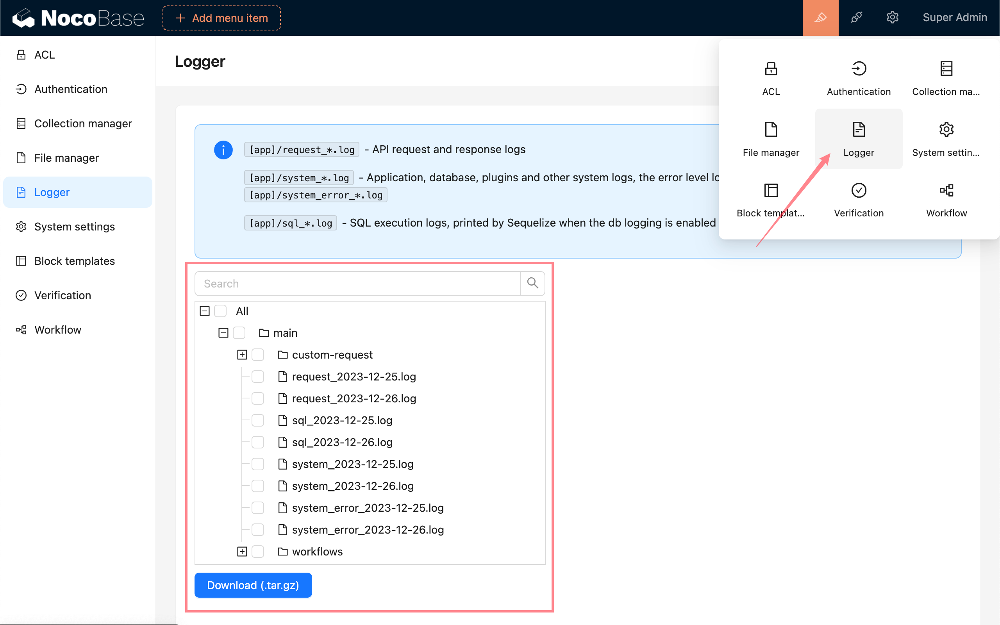

# 日志

## 介绍

日志是帮助我们定位系统问题的重要手段。NocoBase 的服务端日志主要包括接口请求日志和系统运行日志，支持日志级别、滚动策略、大小、打印格式等配置。本篇文档主要介绍 NocoBase 服务端日志的相关内容，以及如何使用日志插件提供的服务端日志打包和下载的功能。

## 日志配置

用户可以通过 [环境变量](../../api/env.md#logger_transport) 配置日志级别、输出方式、打印格式等的日志相关参数。

## 日志格式

NocoBase 支持配置3种不同的日志格式。

### `logfmt`

> https://brandur.org/logfmt.

开发环境默认格式。

```bash
level=info timestamp=2023-12-21 14:18:02 reqId=8b59a40d-68ee-4c97-8001-71a47a92805a
message=response method=POST path=/api/authenticators:publicList res={"status":200}
action={"actionName":"publicList","resourceName":"authenticators","params":{"resourceName":"authenticators","actionName":"publicList"}}
userId=undefined status=200 cost=14
```

### `json`

生产环境默认格式

```json
{
  "level": "info",
  "timestamp": "2023-12-26 22:04:56",
  "reqId": "7612ef42-58e8-4c35-bac2-2e6c9d8ec96e",
  "message": "response",
  "method": "POST",
  "path": "/api/authenticators:publicList",
  "res": { "status": 200 },
  "action": {
    "actionName": "publicList",
    "resourceName": "authenticators",
    "params": { "resourceName": "authenticators", "actionName": "publicList" }
  },
  "status": 200,
  "cost": 16
}
```

### `delimiter`

分隔符 `|` 分割。

```bash
info|2023-12-26 22:07:09|13cd16f0-1568-418d-ac37-6771ee650e14|response|POST|/api/authenticators:publicList|{"status":200}|{"actionName":"publicList","resourceName":"authenticators","params":{"resourceName":"authenticators","actionName":"publicList"}}||200|25
```

## 日志目录

NocoBase 日志文件的主要目录结构为：

- `storage/logs` - 日志输出目录
  - `main` - 主应用名称
    - `request_YYYY-MM-DD.log` - 请求日志
    - `system_YYYY-MM-DD.log` - 系统日志
    - `system_error_YYYY-MM-DD.log` - 系统错误日志
    - `sql_YYYY-MM-DD.log` - SQL 执行日志
    - ...
  - `sub-app` - 子应用名称
    - `request_YYYY-MM-DD.log`
    - ...

## 日志文件

### 请求日志

`request_YYYY-MM-DD.log`, 接口请求和响应日志。

| 字段          | 说明                               |
| ------------- | ---------------------------------- |
| `level`       | 日志级别                           |
| `timestamp`   | 日志打印时间 `YYYY-MM-DD hh:mm:ss` |
| `reqId`       | 请求 ID                            |
| `message`     | `request` 或 `response`            |
| `userId`      | `response` 中才有                  |
| `method`      | 请求方法                           |
| `path`        | 请求路径                           |
| `req` / `res` | 请求/响应内容                      |
| `action`      | 请求资源和参数                     |
| `status`      | 响应状态码                         |
| `cost`        | 请求耗时                           |

:::info{title=提示}
`reqId` 会通过 `X-Request-Id` 响应头携带给前端。
:::

### 系统日志

`system_YYYY-MM-DD.log`, 应用、中间件、插件等系统运行日志，`error` 级别日志会单独打印到 `system_error_YYYY-MM-DD.log`

| 字段        | 说明                               |
| ----------- | ---------------------------------- |
| `level`     | 日志级别                           |
| `timestamp` | 日志打印时间 `YYYY-MM-DD hh:mm:ss` |
| `reqId`     | 请求 ID                            |
| `message`   | 日志消息                           |
| `module`    | 模块                               |
| `submodule` | 子模块                             |
| `method`    | 调用方法                           |
| `meta`      | 其他相关信息, JSON 格式            |

### SQL 执行日志

`sql_YYYY-MM-DD.log`, 数据库 SQL 执行日志。其中 `INSERT INTO` 语句仅保留前 2000 个字符。

| 字段        | 说明                               |
| ----------- | ---------------------------------- |
| `level`     | 日志级别                           |
| `timestamp` | 日志打印时间 `YYYY-MM-DD hh:mm:ss` |
| `reqId`     | 请求 ID                            |
| `sql`       | SQL 语句                           |

## 日志打包下载

1. 进入日志管理页面。
2. 选择想要下载的日志文件。
3. 点击下载 (Download) 按钮。



## 相关文档

- [插件开发 - 服务端 - 日志](../../development/server/logger)
- [API参考 - @nocobase/logger](../../api/logger)
