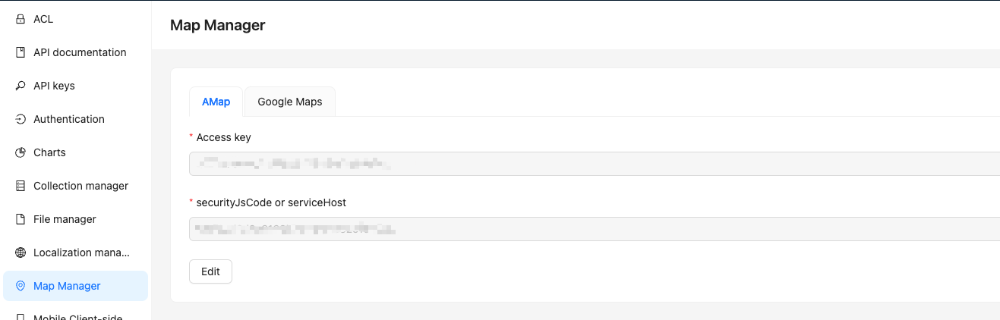
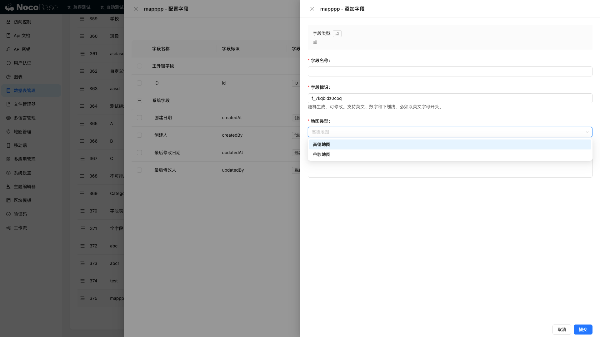
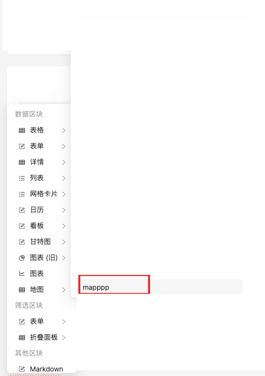
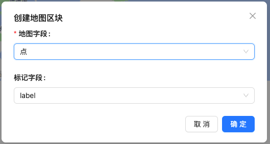
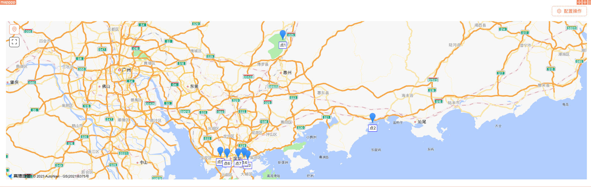
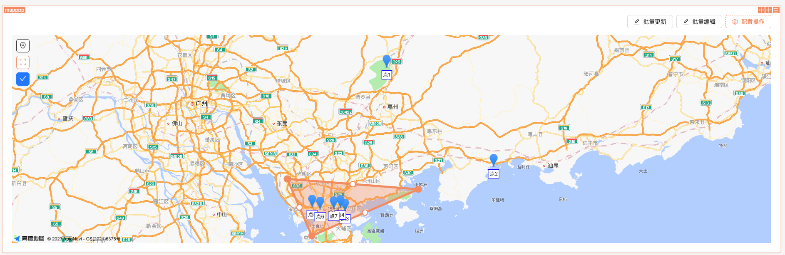
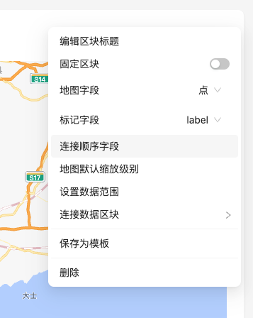
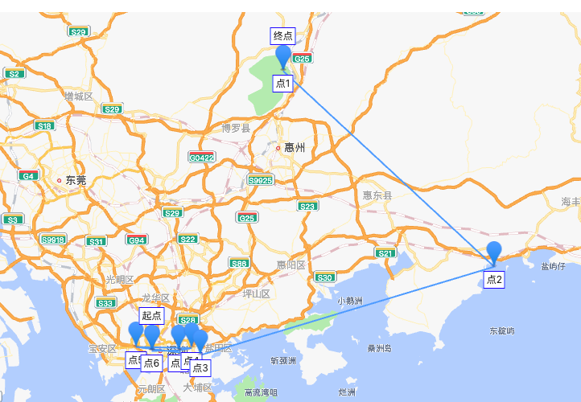

# 地图

## 介绍

地图插件，提供地图组件，地图字段，目前支持高德、谷歌地图。

## 使用说明

### 配置 Access Key

前往如下地址 http://localhost:13000/admin/settings/api-doc/documentation 进入配置页进行配置

> access key 请前往对应平台申请

### 地图字段

目前，我们提供 Point(点), Line(线), Cycle(圆), Polygon(多边形) 四种地图字段类型。

#### 添加地图字段

我们可以在任意表中添加地图字段，如下图所示：

当我们添加这个地图字段时我们可以选择地图类型，如下图所示：

当我们添加完这个字段后，我们可以在创建一个表单区块，并选择我们刚刚使用的数据表，你将看到如下图所示的地图组件：

这样我们就完成了一个地图字段的添加展示和使用，其他字段的使用方式也是一样的。

地图字段不只适用于表单区块，我们也可以在其他区块中使用，呈现的方式可能不同，如在地图，我们看到的这个数据是一个坐标点。

### 地图区块

还是用上面的数据表，我们可以在创建地图区块时选对应的数据表。

点我们选好我们的数据表后，我们可以看到如下图所示：

我们选择我们需要展示的地图字段和标记字段（只有点字段才有），我们可以看到如下图所示：

这些点就是我们的数据表中的数据，我们可以点击这些点，查看对应的数据。

我们还可以框选地图上的点，并批量操作它们

我们可以设置连接顺序字段，这样将把所有点按照顺序连接起来，并展示起点和终点如下图所示：

