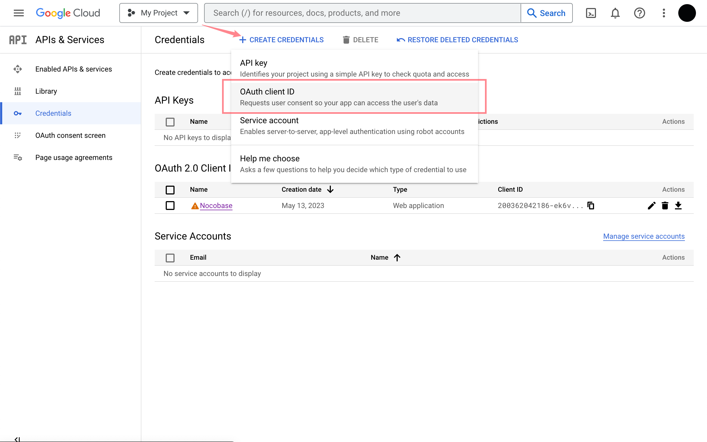
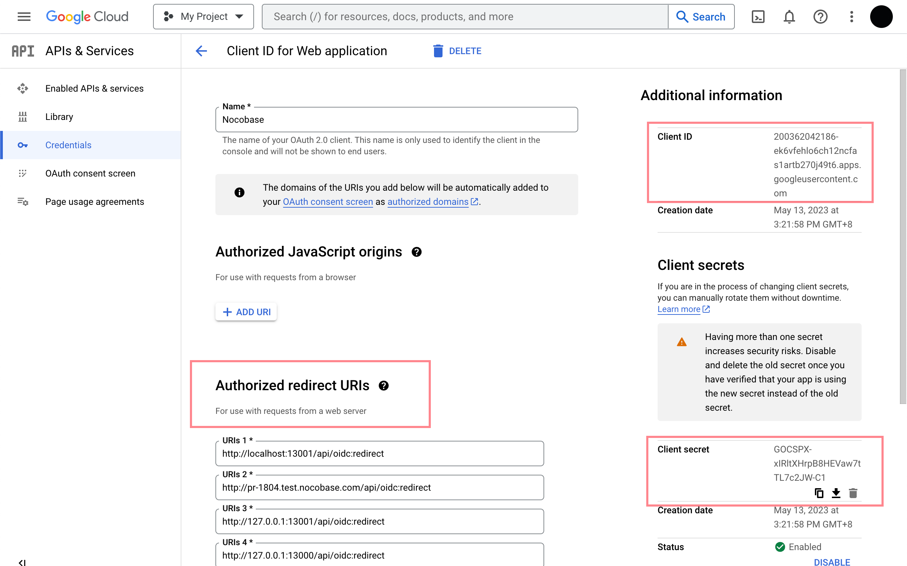
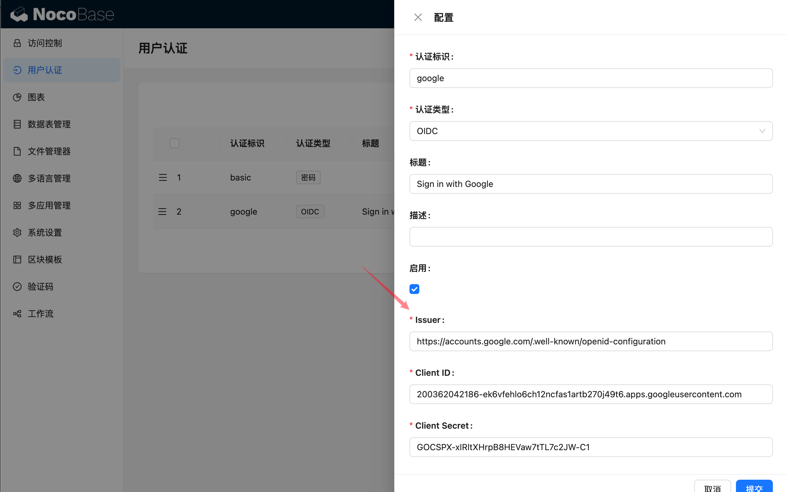

# Sign in with Google

> https://developers.google.com/identity/openid-connect/openid-connect

## 获取 Google OAuth 2.0 凭据

[Google Cloud控制台](https://console.cloud.google.com/apis/credentials) - 创建凭据 - OAuth客户端ID

进入到配置界面，填写授权重定向 URL. 重定向 URL 可以在 Nocobase，新增认证器时获取，通常情况下为 `http(s)://host:port/api/oidc:redirect`. 见[使用手册 - 配置](../index.md#配置)部分。

## 在 NocoBase 上新增认证器

插件设置 - 用户认证 - 添加 - OIDC

参考配[使用手册 - 配置](../index.md#配置)中介绍的参数，完成认证器配置即可。
