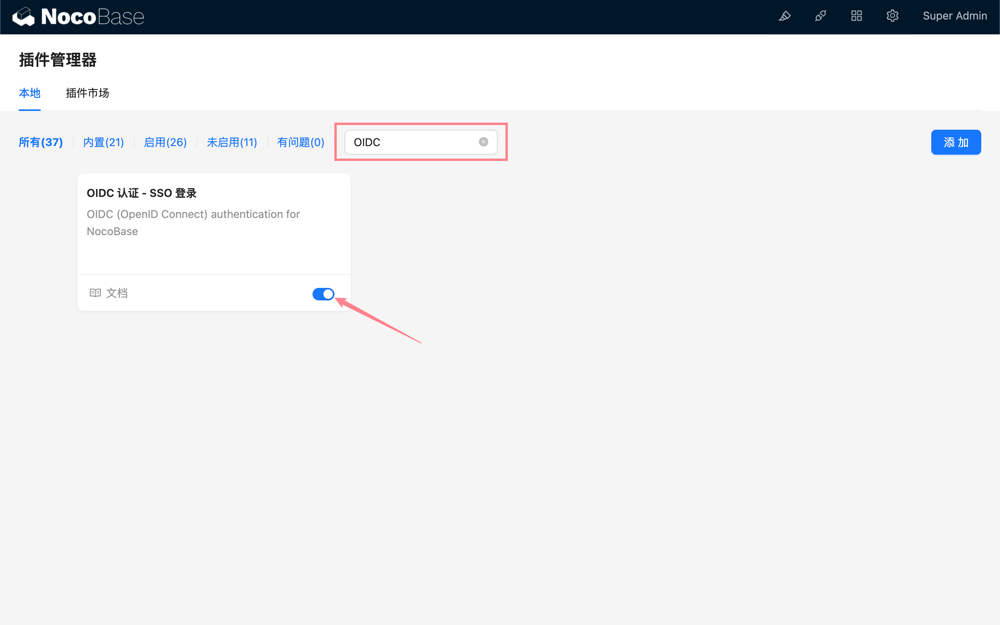
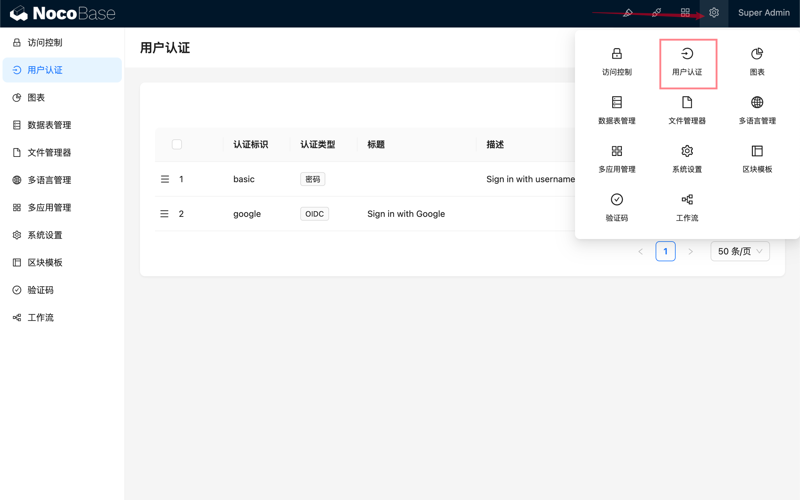
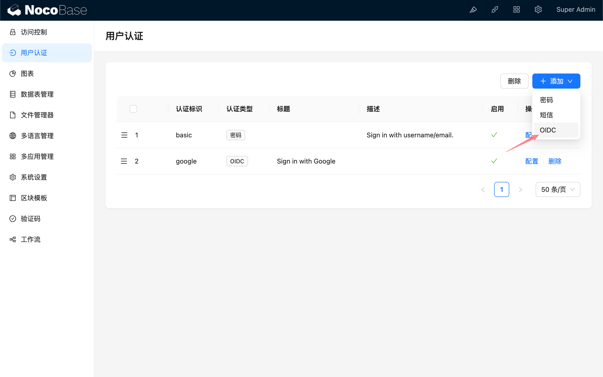
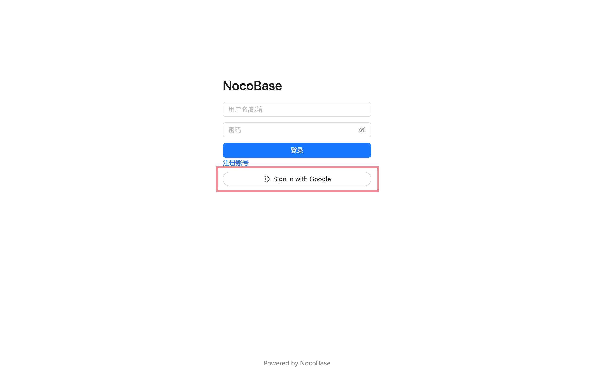

# 使用手册

## 介绍

OIDC 插件遵循 OIDC (Open ConnectID) 协议标准，使用授权码模式 (Authorization Code Flow), 实现用户使用第三方身份认证服务商 (IdP) 提供的账号登录 NocoBase，无需输入用户名和密码。

## 激活插件

## 添加 OIDC 认证

进入用户认证插件管理页面。

添加 - OIDC

## 配置

- Issuer - issuer 由 IdP 提供，通常以 `/.well-known/openid-configuration` 结尾
- Client ID - 客户端ID
- Client Secret - 客户端密钥
- scope - 选填，默认为 `openid email profile`.
- id_token signed response algorithm - id_token 的签名方法，默认为 `RS256`.
- HTTP - 回调地址是否为 http 协议，默认 `https`.
- Port - 回调地址端口，默认为 `443/80`
- Field Map - 字段映射。Nocobase 端目前可供映射的字段有昵称、邮箱和手机号。默认昵称使用 `openid`.
- Use this field to bind the user - 用于和已有用户匹配绑定的字段，可选择邮箱或用户名，默认为邮箱。需要IdP携带的用户信息包含 `email` 或 `username` 字段。
- Sign up automatically when the user does not exist - 当找不到可匹配绑定的已有用户时，是否自动创建新用户。
- 使用 (Usage) - 回调URL (Redirect URL) 用于复制并填写到 IdP 相应配置中。

:::info
本地测试时，URL请使用 `127.0.0.1` 而不是 `localhost`，因为 OIDC 登录方式需要向客户端 cookie 写入 state 用于安全校验。如果登录时出现窗口一闪而过，但是没有登录成功，请检查服务端是否有 state 不匹配的日志以及请求 cookie 中是否包含了 state 参数，这种情况通常是由于客户端 cookie 中的 state 和请求中携带的 state 不匹配。
:::

## 登录

访问登录页面，点击登录表单下方按钮发起第三方登录。

