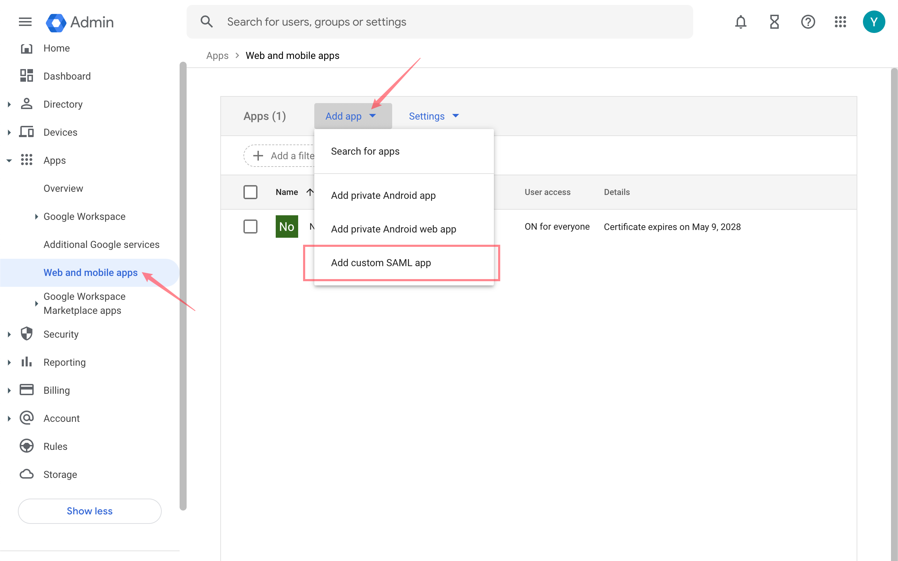
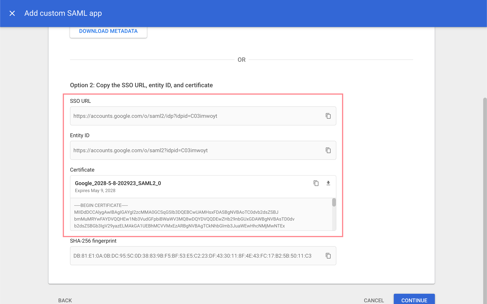
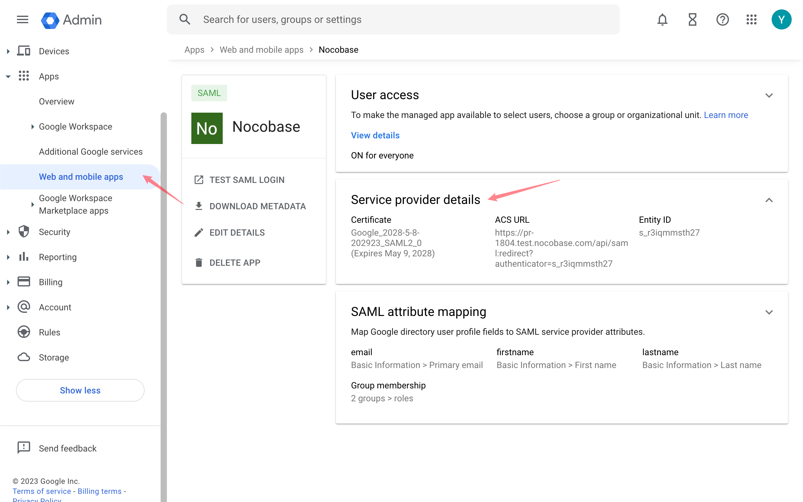

# Google Workspace

## 将 Google 设置为 IdP

[Google管理控制](https://admin.google.com/) - 应用 - Web应用和移动应用

进行应用设置之后，复制 **SSO网址**、**实体ID** 和**证书**。

## 在 NocoBase 上新增认证器

插件设置 - 用户认证 - 添加 - SAML

将刚才复制的信息依次进行填写

- SSO URL: SSO网址
- Public Certificate: 证书
- idP Issuer: Entity ID (实体id)
- http: 如果是在本地http测试，勾选

之后复制 Usage 中的 SP Issuer/EntityID 和 ACS URL.

## 在 Google 上填写 SP 信息

回到Google控制台，在**服务提供商详细信息**页面，输入刚才复制的 ACS 网址和实体 ID，并勾选**已签署响应**。

在**属性映射**位置，添加映射，可以映射对应属性。

