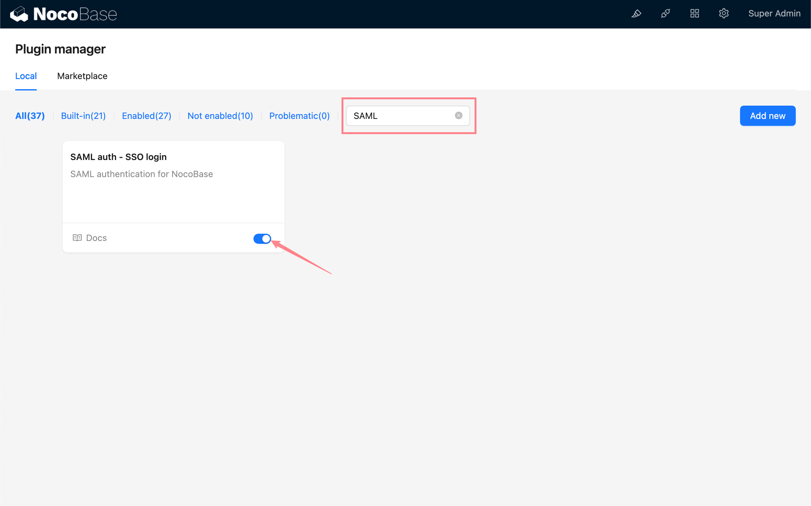
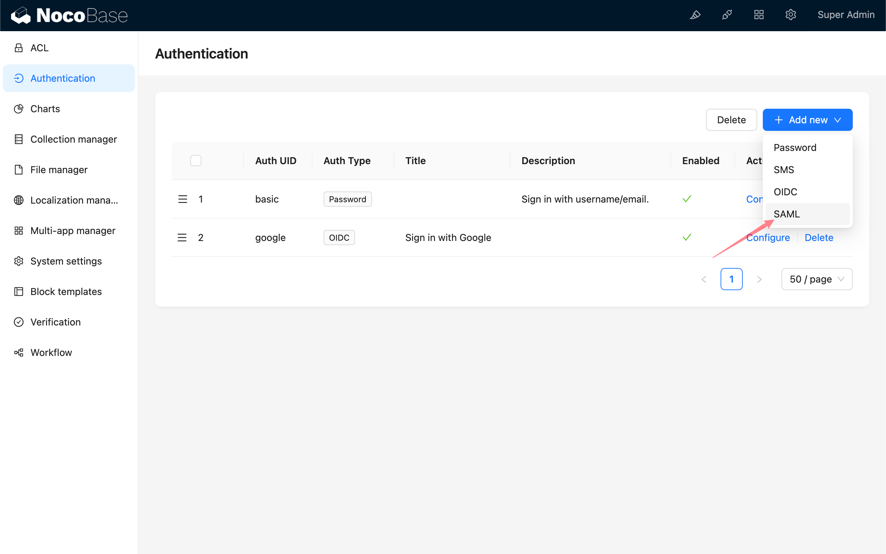
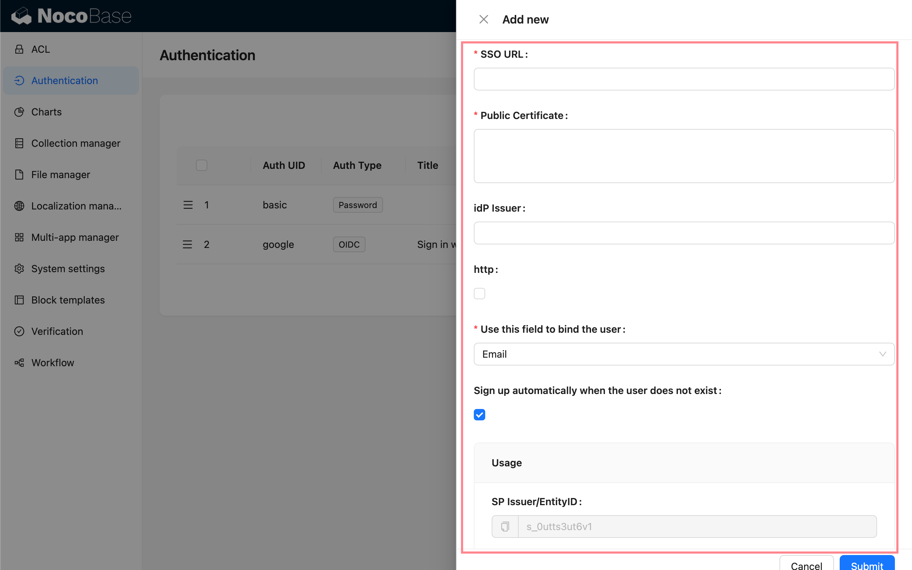
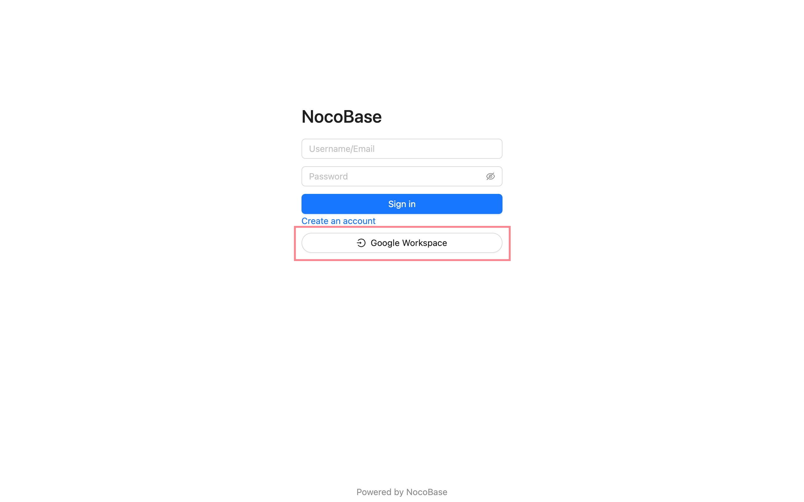

# 使用手册

## 介绍

SAML 插件遵循 SAML2.0 协议标准，实现用户使用第三方身份认证服务商 (IdP) 提供的账号登 录NocoBase，无需输入用户名和密码。

## 激活插件

## 添加 SAML 认证

进入用户认证插件管理页面。

添加 - SAML

## 配置

- SSO URL - 由 IdP 提供，用于单点登录的网址
- 公钥 (Public Certificate) - 由 IdP 提供
- 实体ID (IdP Issuer) - 可选，由 IdP 提供
- http - 如果你的 NocoBase 应用是 http 协议的，请勾选
- Use this field to bind the user - 用于和已有用户匹配绑定的字段，可选择邮箱或用户名，默认为邮箱。需要 IdP 携带的用户信息包含 `email` 或 `username` 字段。
- Sign up automatically when the user does not exist - 当找不到可匹配绑定的已有用户时，是否自动创建新用户。
- 使用 (Usage) - `SP Issuer / EntityID` 和 `ACS URL` 用于复制并填写到 IdP 相应配置中。

## 字段映射

字段映射需要在IdP的配置平台上进行配置，可参考[示例](../saml/example/google.md)。

NocoBase可供映射的字段有：

- email（必填）
- phone (仅对 scope 支持 `phone` 的平台生效，如阿里云，飞书)
- nickname
- username
- firstName
- lastName

`nameID` 为 SAML 协议携带，无需映射，将作为用户唯一标识保存。
新用户昵称使用规则优先级: `nickname` > `firstName lastName` > `username` > `nameID`
暂时不支持映射用户组织、角色。

## 登录

访问登录页面，点击登录表单下方按钮发起第三方登录。

