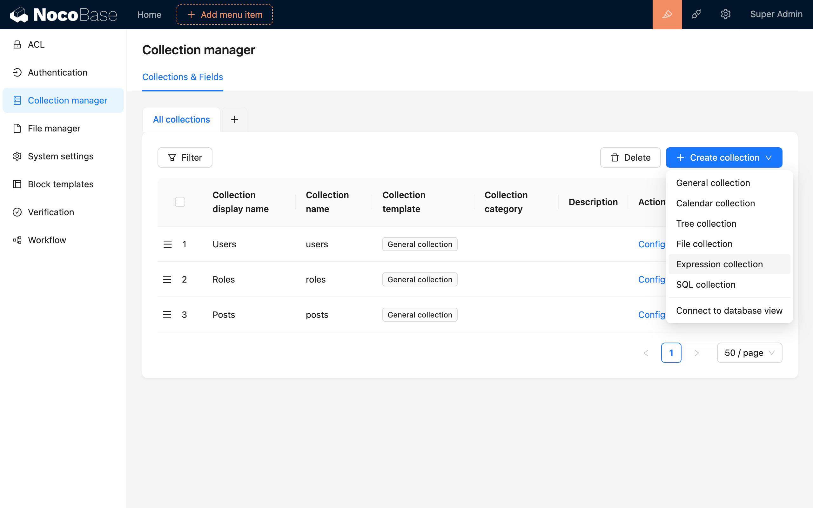
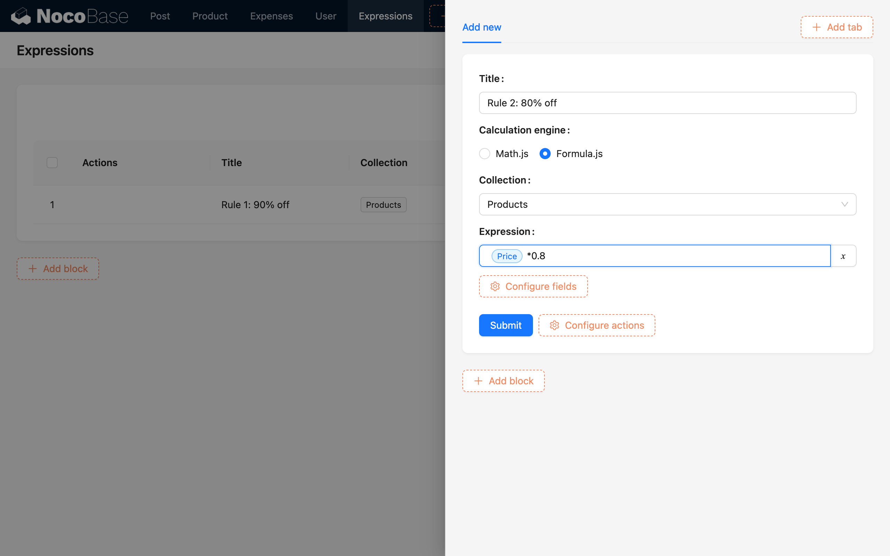
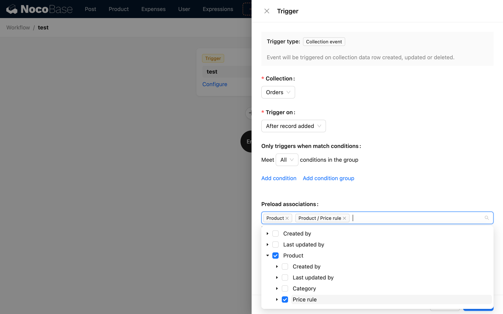
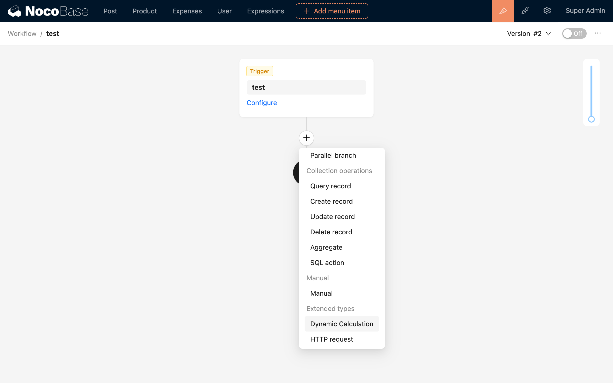
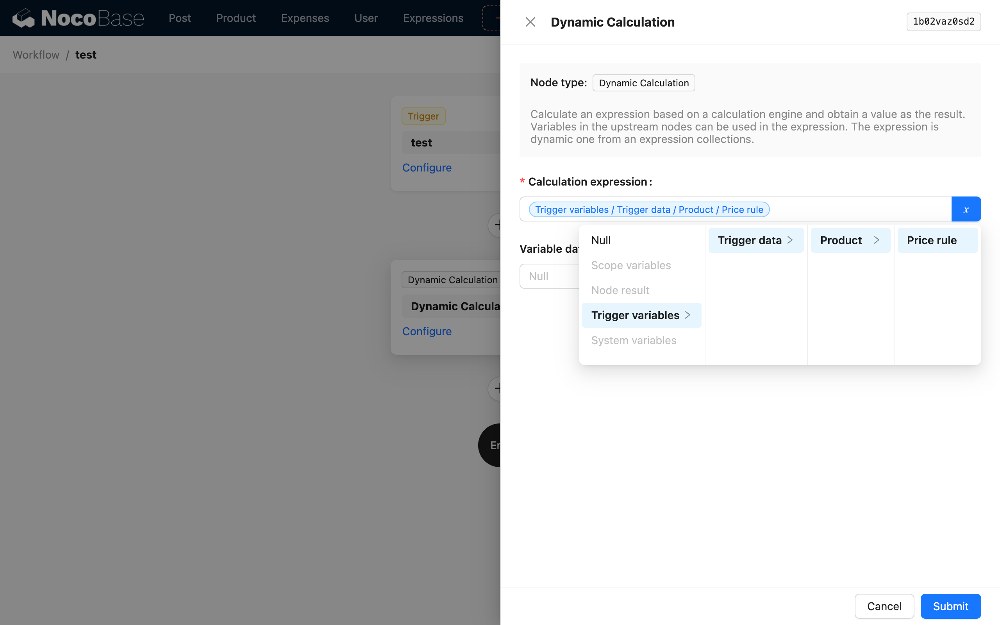
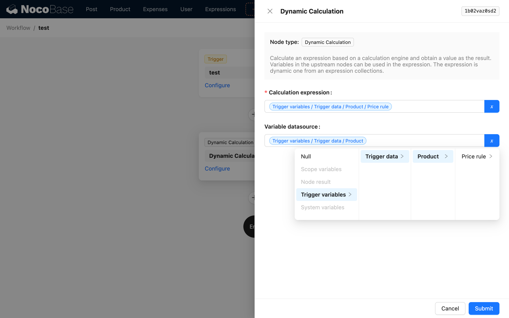
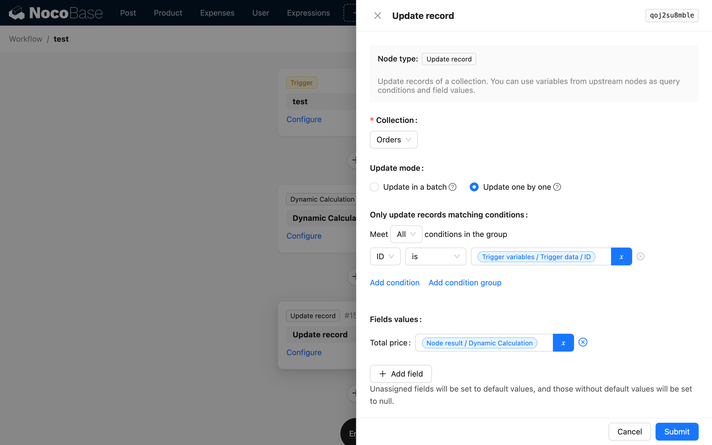
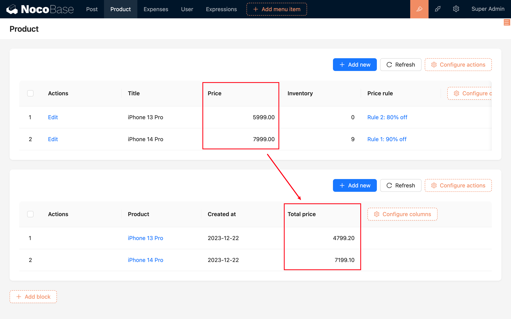

# 动态表达式运算

区别于普通的运算节点只执行固定的表达式计算，动态表达式节点可以基于数据关联的表达式进行不同的计算。其解决的核心问题是由于普通的公式字段针对数据表所有数据行都只能使用同一个固定公式进行计算，而动态表达式可以针对数据行不同计算方式时，在工作流中进行处理以达成动态计算的目标。

例如订单数据在所属不同产品分类下使用不同的统计公式来计算特定的报表数据。

## 安装

内置插件，无需安装。

## 使用手册

### 准备

动态表达式节点的使用与工作流其他较为简单的节点不同，有几个需要前置完成的步骤：

1. 创建“表达式”模板表。
2. 录入表达式数据。
3. 将业务数据与表达式数据建立关联。
4. 通过查询节点或者数据触发时的预加载关系数据加载特定业务数据关联的表达式数据。

以上步骤完成后，再对工作流配置动态表达式节点。

#### 创建“表达式”模板表

在工作流内使用动态表达式运算节点之前，需要先在数据表管理工具中创建一张“表达式”模板表，用于存放不同的表达式：

#### 录入表达式数据

然后创建一个表格区块对该模板表添加几条公式数据，“表达式”模板表中每行数据都可以被理解为针对特定表数据模型的一个计算规则。每行公式数据可使用不同数据表的数据模型中的字段值作为变量，编写不同的表达式作为计算规则，当然，也可以使用不同的计算引擎。

:::info{title=提示}
创建好公式以后还需要将业务数据与公式进行关联，将每行业务数据直接关联公式数据行会比较繁琐，所以通常我们会使用类似分类的元数据表与公式表进行多对一（或一对一）关联，再将业务数据与分类元数据进行多对一的关联，那么在创建业务数据时只需指定特定的分类元数据，即可在后续使用中通过这个关联路径找到对应的公式数据进行使用。
:::

#### 流程中加载相应的数据

以数据表事件为例创建一个工作流，当订单创建时触发，并需要预加载订单关联的商品数据和商品相关的表达式数据：

### 创建节点

创建一个动态表达式计算节点：

### 节点配置

#### 动态表达式

与普通运算节点的表达式选项不同，动态表达式需要根据已经查询出来的数据进行选择，而不是直接录入表达式。选择之前从触发器中预加载的商品优惠规则数据：

#### 变量数据源

同时还需要选择表达式中变量所需要使用的数据表数据行对象，可以从流程的上下文中选择已经提前加载（或查询）出来的结果对象。该对象需要是表达式数据中所关联的数据表的数据行对象，这里选择商品数据：

保存节点配置即完成所有配置流程。

### 示例

根据上面介绍的配置流程，以商品下单过程中根据不同商品进行不同优惠规则的最终价格计算举例。

1.  建立商品表：

    | 字段名   | 类型                      |
    | -------- | ------------------------- |
    | 商品名   | 文本                      |
    | 商品原价 | 数字                      |
    | 优惠规则 | `belongsTo`（优惠规则表） |

2.  建立优惠规则表（使用表达式表模板创建）：

    | 字段名   | 类型                     |
    | -------- | ------------------------ |
    | 规则名称 | 文本                     |
    | 数据表   | 单选（数据表）           |
    | 计算引擎 | 单选（mathjs/formulajs） |
    | 表达式   | 文本                     |

3.  录入优惠规则：

    | ID  | 名称     | 数据表 | 计算引擎   | 表达式                |
    | --- | -------- | ------ | ---------- | --------------------- |
    | 1   | 八折商品 | 商品   | formula.js | `{{商品.价格}} * 0.8` |
    | 2   | 九折商品 | 商品   | formula.js | `{{商品.价格}} * 0.9` |

4.  创建商品，并关联优惠规则：

    | ID  | 商品名称      | 价格 | 优惠规则 |
    | --- | ------------- | ---- | -------- |
    | 1   | iPhone 14 Pro | 7999 | 2        |
    | 2   | iPhone 13 Pro | 6999 | 1        |

5.  创建工作流，订单创建时触发：

    

6.  创建一个动态表达式计算节点，配置动态表达式为触发数据/商品/优惠规则：

    

    配置变量数据源为触发数据中的商品：

    

7.  增加一个更新数据节点，配置更新订单总价为计算节点的结果：

    

8.  创建订单触发工作流，再查看订单列表，核对价格：

    | 订单商品      | 订单商品 / 原价 | 优惠规则 | 总价                 |
    | ------------- | --------------- | -------- | -------------------- |
    | iPhone 14 Pro | 7999            | 九折     | 7999 \* 0.9 = 7199.1 |
    | iPhone 13 Pro | 6999            | 八折     | 6999 \* 0.8 = 5599.2 |

    下图中的总价应与上表中的总价一致：

    

    :::info{title=提示}
    由于工作流是异步执行的，刚创建完订单后表格刷新的结果可能并不包含总价，需要等待一段时间后再刷新查看即可观察到总价。
    :::
