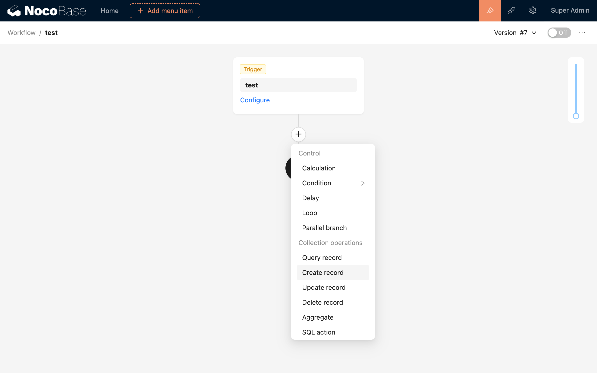
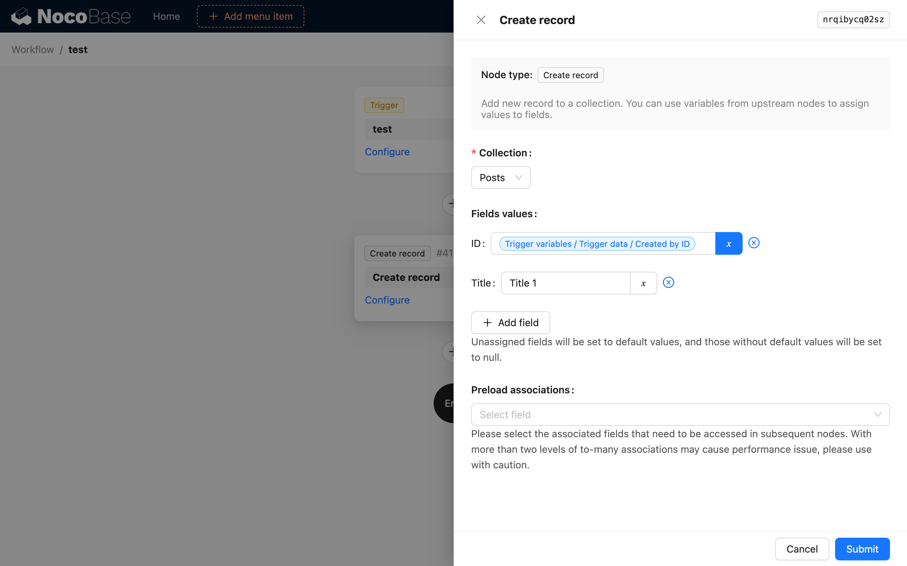
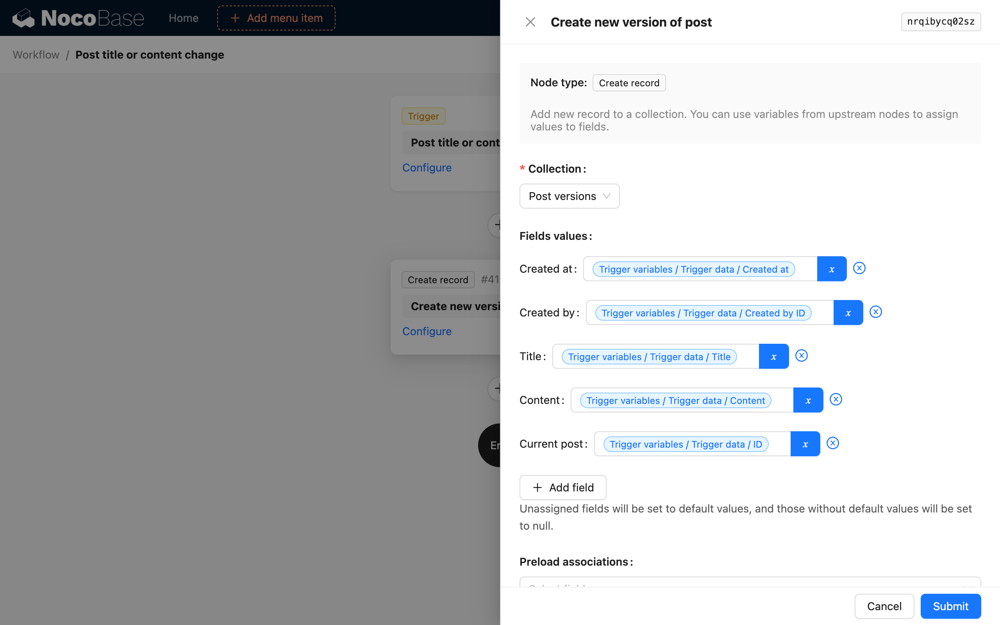

# 新增数据

用于对某个数据表新增一行数据。

新增数据行的字段值可以使用流程上下文的变量，对关系字段的赋值可以直接引用上下文中的对应数据变量，可以是对象，也可以是外键的值。如果不使用变量，则需要手动填写外键的值，对多关系的多个外键值需要使用英文逗号分隔的形式。

## 创建节点

在工作流配置界面中，点击流程中的加号（“+”）按钮，添加“新增数据”节点：

## 节点配置

### 数据表

选择要新增数据的数据表。

### 字段值

针对数据表的字段进行赋值，可以使用流程上下文的变量，也可以手动填写静态值。

注：工作流中新增节点新增的数据不会自动处理“创建人”、“最后修改人”等用户数据，需要根据情况自行配置这两个字段的值。

### 预加载关系数据

如果新增数据的字段中包含关系字段，且希望后续流程中使用相应的关系数据时，可以在预加载配置中勾选相应的关系字段，这样在新增数据完成后，会自动加载相应的关系数据一并储存在节点的结果数据中。

## 示例

例如当“文章”表的数据新增或更新后，需要自动新增一条“文章版本”数据，记录文章的一次变更历史，可以使用新增节点来实现：

按此配置启用工作流后，当“文章”表的数据变更时，会自动新增一条“文章版本”数据，记录文章的变更历史。
