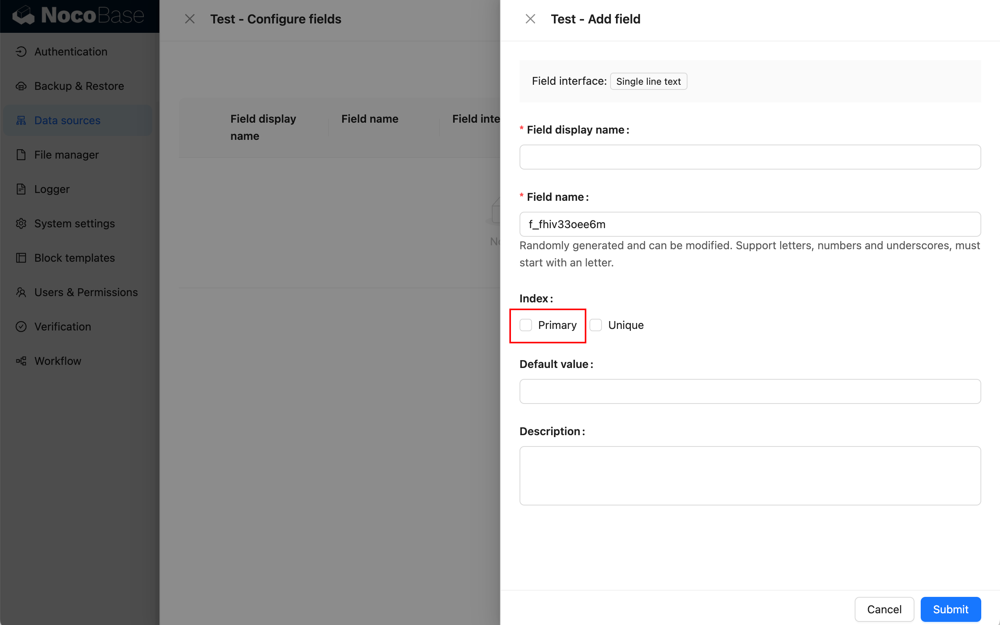
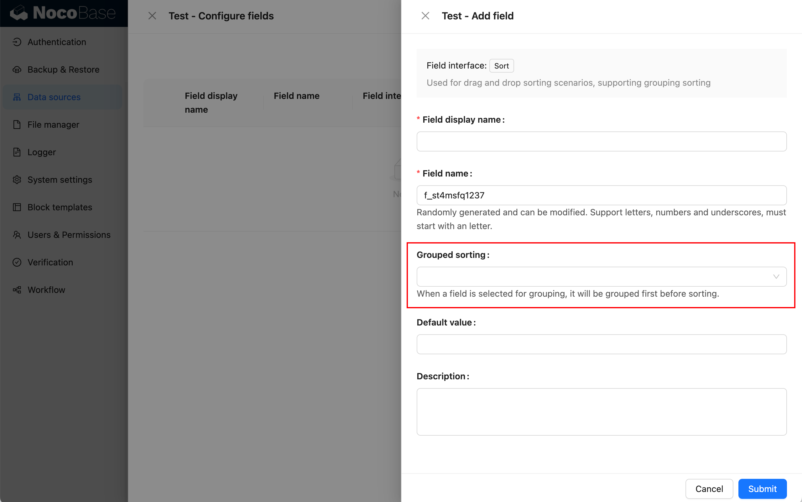
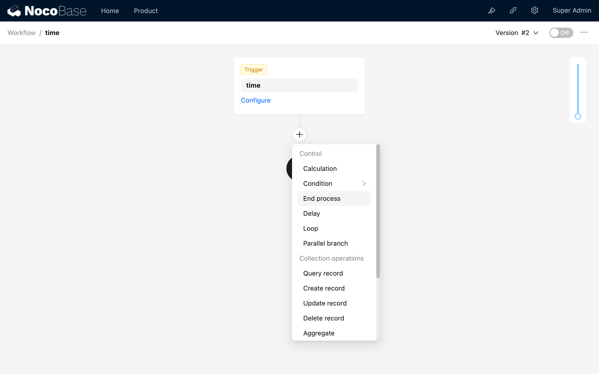
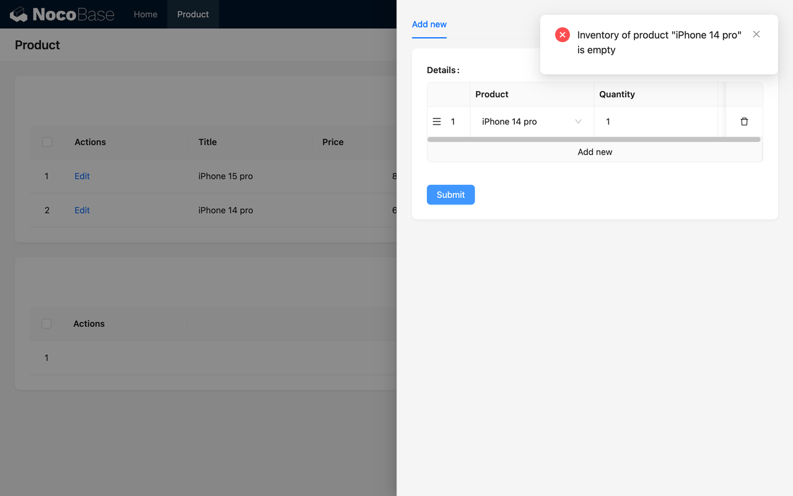

# v0.20：2024-03-03

## 新特性

### 支持多数据源

新增「[数据源管理](/handbook/data-source-manager)」插件，用于管理所有数据源的数据表和字段，数据源管理插件只是提供中心化的数据源管理界面，并不提供接入数据源的能力，需要和各种数据源插件搭配使用，目前支持的数据源包括：

- [主数据库 Main](/handbook/data-source-main)：NocoBase 主数据库，支持 MySQL、PostgreSQL、SQLite 等关系型数据库。
- [外部 MySQL 数据源](/handbook/data-source-external-mysql)：接入已有的 MySQL 数据库作为数据源。
- [外部 MariaDB 数据源](/handbook/data-source-external-mariadb)：接入已有的 MariaDB 数据库作为数据源。
- [外部 PostgreSQL 数据源](/handbook/data-source-external-postgres)：接入已有的 PostgreSQL 数据库作为数据源。

除此之外，也可以扩展更多数据源，可以是常见的各类数据库，也可以是提供 API（SDK）的平台。


### 调整数据表的管理方式

将原来的「数据表管理」移至「数据源 > 主数据库 > 配置」


### 支持非 ID 字段作为主键和关系约束

建表时，可以不选择创建 ID 字段


整数字段可以作为主键


单行文本字段也可以作为主键



关系约束支持选择其他设置了 Unique 索引的非主键字段


### 调整拖拽排序

新增「排序」类型字段，建表时不再自动生成排序字段，需要自己手动创建


当选了某个字段作为分组时，将先分组再排序



表格拖拽排序时，需要选择排序字段


创建看板区块时，需要选择排序字段


### 调整用户和权限界面

新增用户管理界面，并将用户、角色的管理统一到一个菜单内


调整角色管理的界面，便于管理角色关联的用户、权限、部门等数据


将原来的「操作权限」移至「数据源」标签页


### 部门插件


进一步可通过文档了解：[部门](/handbook/departments)

### 工作流：审批

审批插件提供了专用的工作流类型（触发器）“发起审批”和专用于该流程的“审批”节点，结合 NocoBase 特有的自定义数据表和自定义区块，可以快速且灵活地创建与管理各类审批场景。

审批配置


审批处理


进一步可通过文档了解：[工作流：审批](/handbook/workflow-approval)

### 工作流：结束流程节点

该节点执行时将立即结束当前执行的工作流，并以节点配置的状态结束。通常用于特定逻辑的流程控制，在满足某些逻辑条件后，跳出当前工作流，不再继续执行后续流程的处理。可类比编程语言中的 return 指令，用于退出当前执行的函数。



进一步可通过文档了解：[工作流：结束流程节点](/handbook/workflow/manual/nodes/end)

### 工作流：自定义变量节点

可在流程中声明变量，或为已声明的变量赋值，通常用于在流程中保存一些临时数据。适用于一些需要在分支内将计算结果储存到分支外使用的场景（如循环、并行等）。


进一步可通过文档了解：[工作流：自定义变量节点](/handbook/workflow-variable)

### 工作流：请求拦截器

请求拦截器插件提供了一种可以对表单的操作请求进行拦截的机制，拦截事件会在对应的表单操作提交后且被处理之前触发。如果在触发后的流程中有“结束流程”节点被执行，或者其他节点执行失败（出错或其他未能执行完成的情况），则该表单操作将被拦截，否则预定操作将被正常执行。
搭配使用“响应消息”节点可以为该流程配置返回客户端的响应消息，以对客户端给出相应的提示信息。
请求拦截器可用于进行业务验证或逻辑检查，以通过或拦截客户端提交的创建、更新和删除等操作请求。


进一步可通过文档了解：[工作流：请求拦截器](/handbook/workflow-request-interceptor)

### 工作流：响应消息节点

响应消息节点用于在特定类型的流程中（如请求拦截和表单事件）向提交操作的客户端反馈流程中自定义的消息。

节点配置


提示信息



进一步可通过文档了解：[工作流：响应消息节点](/handbook/workflow-response-message)

## 不兼容的变化

### 命名相同但有冲突的 API

这一次的内核变更，有些新版 API 与旧版命名存在冲突，这些有冲突的旧版 API 在这一版里还会保留，但是会统一加上 `_deprecated ` 后缀。

| 原来的 API           | 废弃的 API                      | 新 API                                                                                                                 |
| -------------------- | ------------------------------- | ---------------------------------------------------------------------------------------------------------------------- |
| CollectionProvider   | CollectionProvider_deprecated   | [CollectionProvider](https://client.docs-cn.nocobase.com/core/data-source/collection-provider)                 |
| useCollection        | useCollection_deprecated        | [useCollection](https://client.docs-cn.nocobase.com/core/data-source/collection-provider#hooks)                |
| useCollectionField   | useCollectionField_deprecated   | [useCollectionField](https://client.docs-cn.nocobase.com/core/data-source/collection-field#hooks)              |
| useCollectionManager | useCollectionManager_deprecated | [useCollectionManager](https://client.docs-cn.nocobase.com/core/data-source/collection-manager-provider#hooks) |
| useContext(CollectionManagerContext) | useCollectionManager_deprecated | [useCollectionManager](https://client.docs-cn.nocobase.com/core/data-source/collection-manager-provider#hooks) |

如果用到以上相关 API，你可以有两种更改方式：

- 简单替换：将原来的 API 替换为带 `_deprecated`，例如将 `useCollection()` 替换为 `useRecord_deprecated()`
- 按照新文档使用新 API：虽然新 API 的名称和老 API 相同，但是参数和返回值存在差异，需要参考新文档调整相应代码

### 其他需要调整的 API

- `registerTemplate()` 变更为 `app.dataSourceManager.addCollectionTemplates()`
- `registerField()` 变更为 `app.dataSourceManager.addFeildInterfaces()`
- `registerGroup()` 变更为 `app.dataSourceManager.addFieldInterfaceGroups()`
- `useContext(CollectionManagerContext)` 变更为 `useCollectionManager_deprecated()`
- 使用 `ExtendCollectionsProvider` 扩展 collections
- `RecordProvider` 需要 parent 参数时，必须显式传入

## 变更示例说明

### Collection Template 扩展

#### 定义

之前是对象定义的方式，现在需要改为类的方式。 例如：

之前

```typescript
import { ICollectionTemplate } from '@nocobase/client';

const calendar: ICollectionTemplate = {
  name: 'calendar',
  title: 'Calendar collection',
  order: 2,
  color: 'orange',
  // ...
}
```

现在

```typescript
import { CollectionTemplate } from '@nocobase/client';

class CalendarCollectionTemplate extends CollectionTemplate {
  name = 'calendar';
  title = 'Calendar collection';
  order = 2;
  color = 'orange';
}
```

原来的对象属性变为类的成员。

#### 注册

之前是通过 `registerTemplate` 注册的，现在需要通过插件的 `dataSourceManager.addCollectionTemplates` 注册。例如：

之前

```typescript
import { registerTemplate } from '@nocobase/client';
import { calendar } from './calendar'

registerTemplate('calendar', calendar);
```

现在

```typescript
import { Plugin } from '@nocobase/client';
import { CalendarCollectionTemplate } from './calendar'

export class CalendarPluginClient extends Plugin {
  async load() {
    this.app.dataSourceManager.addCollectionTemplates([CalendarCollectionTemplate]);
  }
}
```

### Field Interface 扩展

#### 定义

之前是对象定义的方式，现在需要改为类的方式。 例如：

之前

```typescript
import { IField } from '@nocobase/client';

const attachment: IField = {
  name: 'attachment',
  type: 'object',
  group: 'media',
  title: 'Attachment',
  // ...
}
```

现在

```typescript
import { CollectionFieldInterface } from '@nocobase/client';

class AttachmentFieldInterface extends CollectionFieldInterface {
  name = 'attachment';
  type = 'object';
  group = 'media';
  title = 'Attachment';
  // ...
}
```

原来的对象属性变为类的成员。

#### 注册

之前是通过 `registerField` 注册的，现在需要通过插件的 `dataSourceManager.addFieldInterfaces` 注册，并且不需要 `CollectionManagerProvider` 再次传递。例如：

之前

```diff
import { registerField } from '@nocobase/client';
import { attachment } from './attachment'

- registerField(attachment.group, 'attachment', attachment);

export const FileManagerProvider: FC = (props) => {
  return (
-   <CollectionManagerProvider interfaces={{ attachment }}>
      <SchemaComponentOptions scope={hooks} components={{ UploadActionInitializer }}>
        {props.children}
      </SchemaComponentOptions>
-   </CollectionManagerProvider>
  );
};
```

现在

```typescript
import { Plugin } from '@nocobase/client';
import { AttachmentFieldInterface } from './attachment'

export class FilPlugin extends Plugin {
  async load() {
    this.app.dataSourceManager.addFeildInterfaces([AttachmentFieldInterface]);
  }
}
```

### Field Interface Group 扩展

之前是通过 `registerGroup` 注册的，现在需要通过插件的 `dataSourceManager.addFieldInterfaceGroups` 注册。例如：

```diff
- import { registerGroup, Plugin } from '@nocobase/client';
+ import { Plugin } from '@nocobase/client';

- registerGroup('map', {
-        label: 'Map-based geometry',
-        order: 10
- })

export class MapPlugin extends Plugin {
  async load() {
+    this.app.dataSourceManager.addFieldInterfaceGroups({
+      map: {
+        label: generateNTemplate('Map-based geometry'),
+        order: 51,
+      },
+    });
  }
}
```

### `useContext(CollectionManagerContext)` 改为 `useCollectionManager_deprecated()`

```diff
- const ctx = useContext(CollectionManagerContext);
+ const ctx = useCollectionManager_deprecated();
```

### 扩展 collections，使用 `ExtendCollectionsProvider` 代替 `CollectionManagerProvider`

```diff
const Demo = () => {
-  <CollectionManagerProvider collections={[apiKeysCollection]}>
+  <ExtendCollectionsProvider collections={[apiKeysCollection]}>
...
-  </CollectionManagerProvider>
+  </ExtendCollectionsProvider>
}
```

### RecordProvider 的变更

之前在不传入 parent 属性的时候，会自动获取上一级的 RecordProvider 的值作为 parent。现在则需要显式的传入 parent，当不传 parent 的时候，parent 的值将是 undefined。

```diff
- <RecordProvider record={recordData}>
+ <RecordProvider record={recordData} parent={parentRecordData}> 
...
</RecordProvider>
```

如果没有历史包袱，也可以直接使用 CollectionRecordProvider 替换

```diff
- <RecordProvider record={recordData}>
+ <CollectionRecordProvider record={recordData} parent={parentRecordData}> 
...
- </RecordProvider>
+ </CollectionRecordProvider>
```

:::warning{title="RecordProvider 和 CollectionRecordProvider 的区别"}
- RecordProvider 已废弃，未来会被移除
- RecordProvider 带了旧的 RecordContext，CollectionRecordProvider 没有
:::